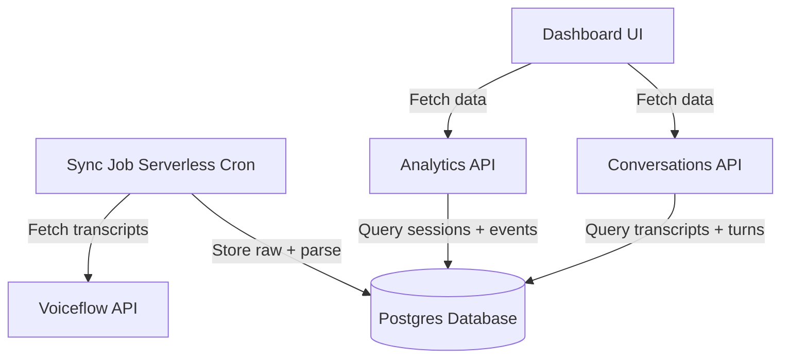

# Refactor to Database-Backed Transcript Storage

## Overview

Migrate from direct Voiceflow API calls to a **local Postgres database** with 4 tables for storing transcripts, sessions, events, and conversation turns. Analytics will query the database instead of the API, and a periodic sync job will keep data fresh.---

## Architecture



**Data Flow:**

1. **Periodic sync** (every 5-15 minutes via Railway Cron) fetches new/updated transcripts from Voiceflow
2. **Ingestion pipeline** stores raw JSON, parses turns, reconstructs state (typeuser/location/rating/feedback), and upserts sessions/events
3. **Dashboard queries** hit the local database for fast, flexible analytics
4. **State reconstruction** uses hybrid approach: Voiceflow properties first, fallback to trace parsing

---

## Database Schema

### 1. **vf_sessions** (analytics-ready final state)

```sql
create table public.vf_sessions (
  id uuid primary key default gen_random_uuid(),
  session_id text not null unique,
  user_id text null,
  
  transcript_id text null,
  transcript_row_id uuid null references public.vf_transcripts(id),
  
  typeuser text null check (typeuser in ('tenant','investor','owneroccupier')),
  location_type text null check (location_type in ('rental','investor','owneroccupier')),
  location_value text null,
  
  rating int null check (rating between 1 and 5),
  feedback text null,
  constraint feedback_rule check (
    feedback is null OR (rating is not null and rating between 1 and 3)
  ),
  
  started_at timestamptz null,
  ended_at timestamptz null,
  
  created_at timestamptz not null default now(),
  updated_at timestamptz not null default now()
);

create index on public.vf_sessions (typeuser);
create index on public.vf_sessions (location_type, location_value);
create index on public.vf_sessions (created_at);
create index on public.vf_sessions (transcript_id);
```


### 2. **vf_events** (funnel tracking + CTA visibility)

```sql
create table public.vf_events (
  id uuid primary key default gen_random_uuid(),
  session_id text not null references public.vf_sessions(session_id),
  user_id text null,
  
  event_type text not null,
  event_ts timestamptz not null default now(),
  
  typeuser text null check (typeuser in ('tenant','investor','owneroccupier')),
  location_type text null check (location_type in ('rental','investor','owneroccupier')),
  location_value text null,
  rating int null check (rating between 1 and 5),
  feedback text null,
  
  cta_id text null,
  cta_name text null,
  
  meta jsonb not null default '{}'::jsonb
);

create index on public.vf_events (session_id, event_ts);
create index on public.vf_events (event_type, event_ts);
create index on public.vf_events (cta_id);
```


### 3. **vf_transcripts** (raw storage)

```sql
create table public.vf_transcripts (
  id uuid primary key default gen_random_uuid(),
  transcript_id text null unique,
  session_id text not null,
  user_id text null,
  
  source text not null default 'voiceflow',
  
  started_at timestamptz null,
  ended_at timestamptz null,
  
  raw jsonb not null,
  raw_hash text null,
  
  created_at timestamptz not null default now(),
  updated_at timestamptz not null default now()
);

create index on public.vf_transcripts (session_id);
create index on public.vf_transcripts (transcript_id);
create index on public.vf_transcripts (created_at);
```


### 4. **vf_turns** (normalized messages)

```sql
create table public.vf_turns (
  id uuid primary key default gen_random_uuid(),
  transcript_row_id uuid not null references public.vf_transcripts(id) on delete cascade,
  session_id text not null,
  
  turn_index int not null,
  role text not null check (role in ('user','assistant','system','tool','trace')),
  
  text text null,
  payload jsonb not null default '{}'::jsonb,
  
  timestamp timestamptz null,
  
  created_at timestamptz not null default now(),
  
  unique (transcript_row_id, turn_index)
);

create index on public.vf_turns (session_id, turn_index);
create index on public.vf_turns (transcript_row_id);
create index on public.vf_turns (role);

-- Full-text search for keywords/topics
alter table public.vf_turns
add column text_tsv tsvector generated always as (to_tsvector('english', coalesce(text,''))) stored;

create index vf_turns_text_tsv_idx on public.vf_turns using gin (text_tsv);
```

---

## Implementation Plan

### Phase 1: Database Setup (Railway Postgres)

**Files to create:**

- [`db/migrations/001_create_vf_tables.sql`](db/migrations/001_create_vf_tables.sql) - Schema creation
- [`lib/db.ts`](lib/db.ts) - Postgres client using `pg`
- [`.env.local.example`](.env.local.example) - Add `DATABASE_URL` example

**Railway Setup:**

1. In Railway dashboard: **New → Database → Add PostgreSQL**
2. Railway automatically provides `DATABASE_URL` environment variable
3. Copy connection string for local development

**Actions:**

1. Install `pg` and `@types/pg`: `npm install pg && npm install -D @types/pg`
2. Create migration file with all 4 table definitions
3. Set up database connection pool in `lib/db.ts`
4. Run migration against your Postgres instance

### Phase 2: Transcript Ingestion Pipeline

**Files to create:**

- [`lib/transcriptIngestion.ts`](lib/transcriptIngestion.ts) - Core ingestion logic
- [`lib/stateReconstructor.ts`](lib/stateReconstructor.ts) - Extract typeuser/location/rating from properties + traces
- [`lib/eventInference.ts`](lib/eventInference.ts) - Infer funnel events from state changes
- [`app/api/sync-transcripts/route.ts`](app/api/sync-transcripts/route.ts) - API endpoint for manual/scheduled sync

**Ingestion Flow:**

```typescript
// lib/transcriptIngestion.ts
async function ingestTranscript(rawTranscript) {
  // 1. Insert/update vf_transcripts with raw JSON
  const transcriptRow = await upsertTranscriptRow(rawTranscript);
  
  // 2. Parse turns and insert into vf_turns
  const turns = parseTranscriptTurns(rawTranscript.logs);
  await insertTurns(transcriptRow.id, turns);
  
  // 3. Reconstruct session state (hybrid approach)
  const state = await reconstructState(rawTranscript, turns);
  
  // 4. Upsert vf_sessions with final state
  await upsertSession({
    session_id: rawTranscript.sessionID,
    transcript_row_id: transcriptRow.id,
    ...state
  });
  
  // 5. Infer and insert events
  const events = inferEvents(state, turns);
  await insertEvents(events);
}
```

**State Reconstruction Logic:**Leverage existing [`lib/propertyParser.ts`](lib/propertyParser.ts) logic:

```typescript
// lib/stateReconstructor.ts
function reconstructState(transcript, turns) {
  // 1. Try Voiceflow properties first (existing parseVoiceflowVariables)
  const vars = parseVoiceflowVariables(transcript.properties);
  
  // 2. Fallback: scan turns for "set variable" traces
  if (!vars.typeuser) {
    vars.typeuser = findVariableInTraces(turns, 'typeuser');
  }
  
  if (!vars.rentallocation && !vars.investorlocation && !vars.owneroccupierlocation) {
    // Parse location from traces
    const location = findLocationInTraces(turns, vars.typeuser);
    // ... assign to appropriate location field
  }
  
  // 3. Map to database schema
  return {
    typeuser: vars.typeuser,
    location_type: deriveLocationType(vars),
    location_value: deriveLocationValue(vars),
    rating: extractRatingScore(vars.rating),
    feedback: vars.feedback,
    started_at: transcript.createdAt,
    ended_at: transcript.endedAt || transcript.updatedAt
  };
}
```

**Event Inference:**

```typescript
// lib/eventInference.ts
function inferEvents(state, turns) {
  const events = [];
  
  if (state.typeuser) {
    events.push({
      event_type: 'typeuser_selected',
      event_ts: findTimestampForVariable(turns, 'typeuser'),
      typeuser: state.typeuser,
      // ...
    });
  }
  
  if (state.location_value) {
    events.push({
      event_type: 'location_selected',
      event_ts: findTimestampForVariable(turns, 'location'),
      location_type: state.location_type,
      location_value: state.location_value,
      // ...
    });
  }
  
  if (state.rating) {
    events.push({
      event_type: 'rating_submitted',
      rating: state.rating,
      // ...
    });
  }
  
  // ... CTA events from traces
  
  return events;
}
```


### Phase 3: Sync Strategy (Railway Cron Jobs)

**Files to create:**

- [`app/api/sync-transcripts/route.ts`](app/api/sync-transcripts/route.ts) - Sync endpoint (manual + cron)

**Railway Cron Setup:**

1. **In Railway Dashboard:**

- Go to your Next.js service
- Click **Settings** → **Cron Jobs**
- Click **Add Cron Job**
- Schedule: `*/15 * * * *` (every 15 minutes)
- Command: `curl -X POST https://$RAILWAY_PUBLIC_DOMAIN/api/sync-transcripts -H "Authorization: Bearer $CRON_SECRET"`

2. **Set Environment Variable:**

- Add `CRON_SECRET=<random-string>` in Railway dashboard

**Endpoint Implementation:**

```typescript
// app/api/sync-transcripts/route.ts
export async function POST(request: NextRequest) {
  // Verify cron secret for security
  const authHeader = request.headers.get('authorization');
  if (authHeader !== `Bearer ${process.env.CRON_SECRET}`) {
    return new Response('Unauthorized', { status: 401 });
  }
  
  // Fetch latest transcripts from Voiceflow
  const transcripts = await fetchAllTranscripts();
  
  // Ingest each transcript
  for (const t of transcripts) {
    await ingestTranscript(t);
  }
  
  return NextResponse.json({ synced: transcripts.length });
}

// For local dev: allow manual trigger via GET
export async function GET() {
  if (process.env.NODE_ENV !== 'development') {
    return new Response('Only available in development', { status: 403 });
  }
  
  const transcripts = await fetchAllTranscripts();
  for (const t of transcripts) {
    await ingestTranscript(t);
  }
  
  return NextResponse.json({ synced: transcripts.length });
}
```


### Phase 4: Refactor Analytics to Query Database

**Files to modify:**

- [`app/api/analytics/route.ts`](app/api/analytics/route.ts) - Replace Voiceflow API calls with DB queries
- [`lib/analyticsQueries.ts`](lib/analyticsQueries.ts) - New file with typed SQL queries

**Example Queries:**

```typescript
// lib/analyticsQueries.ts

// Category breakdown (Rent/Sales Ratio)
async function getCategoryBreakdown(startDate: string, endDate: string) {
  const result = await db.query(`
    SELECT 
      typeuser,
      COUNT(*) as count
    FROM vf_sessions
    WHERE started_at >= $1 AND started_at <= $2
      AND typeuser IS NOT NULL
    GROUP BY typeuser
  `, [startDate, endDate]);
  
  return {
    tenant: result.rows.find(r => r.typeuser === 'tenant')?.count || 0,
    investor: result.rows.find(r => r.typeuser === 'investor')?.count || 0,
    owneroccupier: result.rows.find(r => r.typeuser === 'owneroccupier')?.count || 0,
  };
}

// Location breakdown
async function getLocationBreakdown(startDate: string, endDate: string) {
  const result = await db.query(`
    SELECT 
      location_type,
      location_value,
      COUNT(*) as count
    FROM vf_sessions
    WHERE started_at >= $1 AND started_at <= $2
      AND location_type IS NOT NULL
      AND location_value IS NOT NULL
    GROUP BY location_type, location_value
  `, [startDate, endDate]);
  
  // Transform to existing LocationBreakdownActual shape
  // ...
}

// Satisfaction score
async function getSatisfactionScore(startDate: string, endDate: string) {
  const result = await db.query(`
    SELECT 
      rating,
      COUNT(*) as count,
      started_at::date as date
    FROM vf_sessions
    WHERE started_at >= $1 AND started_at <= $2
      AND rating IS NOT NULL
    GROUP BY rating, started_at::date
    ORDER BY started_at::date
  `, [startDate, endDate]);
  
  // Calculate average, distribution, trend
  // ...
}

// Feedback entries
async function getFeedback(startDate: string, endDate: string) {
  const result = await db.query(`
    SELECT 
      rating,
      feedback as text,
      started_at as timestamp,
      transcript_id as "transcriptId"
    FROM vf_sessions
    WHERE started_at >= $1 AND started_at <= $2
      AND feedback IS NOT NULL
      AND rating <= 3
    ORDER BY started_at DESC
  `, [startDate, endDate]);
  
  return {
    items: result.rows,
    totalCount: result.rows.length
  };
}

// Funnel breakdown (events table)
async function getFunnelBreakdown(startDate: string, endDate: string) {
  const result = await db.query(`
    SELECT 
      typeuser,
      COUNT(*) FILTER (WHERE event_type = 'typeuser_selected') as clicks,
      COUNT(*) FILTER (WHERE event_type = 'location_selected') as location_selections
    FROM vf_events
    WHERE event_ts >= $1 AND event_ts <= $2
      AND typeuser IS NOT NULL
    GROUP BY typeuser
  `, [startDate, endDate]);
  
  // Transform to funnel shape
  // ...
}
```

**Refactor [`app/api/analytics/route.ts`](app/api/analytics/route.ts):**Replace the current Voiceflow API calls with database queries:

```typescript
// Before: fetchAnalytics(projectId, apiKey, startDate, endDate)
// After:
const categoryBreakdown = await getCategoryBreakdown(startDate, endDate);
const locationBreakdown = await getLocationBreakdown(startDate, endDate);
const satisfactionScore = await getSatisfactionScore(startDate, endDate);
const feedback = await getFeedback(startDate, endDate);
const funnel = await getFunnelBreakdown(startDate, endDate);
```


### Phase 5: Refactor Conversations to Query Database

**Files to modify:**

- [`app/api/conversations/route.ts`](app/api/conversations/route.ts) - Query `vf_transcripts` instead of Voiceflow API
- [`app/api/conversations/[id]/route.ts`](app/api/conversations/[id]/route.ts) - Query `vf_turns` for dialog
- [`lib/conversationQueries.ts`](lib/conversationQueries.ts) - New file with conversation queries

**Example:**

```typescript
// lib/conversationQueries.ts

async function fetchTranscriptSummaries(filters: ConversationFilters) {
  const { query, platform, startTime, endTime, limit, cursor } = filters;
  
  const result = await db.query(`
    SELECT 
      t.id,
      t.transcript_id,
      t.session_id,
      t.user_id,
      t.started_at as "createdAt",
      t.ended_at as "lastInteractionAt",
      t.raw->'properties' as properties,
      s.typeuser,
      s.location_value,
      (SELECT COUNT(*) FROM vf_turns WHERE transcript_row_id = t.id) as "messageCount"
    FROM vf_transcripts t
    LEFT JOIN vf_sessions s ON s.session_id = t.session_id
    WHERE t.started_at >= $1 AND t.started_at <= $2
    ORDER BY t.started_at DESC
    LIMIT $3 OFFSET $4
  `, [startTime, endTime, limit, cursor]);
  
  return result.rows.map(mapToTranscriptSummary);
}

async function fetchTranscriptDialog(transcriptId: string) {
  const result = await db.query(`
    SELECT 
      id,
      role,
      text as content,
      timestamp,
      payload as raw
    FROM vf_turns
    WHERE transcript_row_id = (
      SELECT id FROM vf_transcripts WHERE transcript_id = $1
    )
    ORDER BY turn_index ASC
  `, [transcriptId]);
  
  return result.rows;
}
```


### Phase 6: Testing & Migration

**Actions:**

1. Run initial sync to populate database with existing transcripts
2. Compare analytics output between old (API) and new (DB) implementations
3. Test conversation replay with database-backed turns
4. Add database backups and monitoring
5. Remove or deprecate direct Voiceflow API calls from analytics

---

## Files to Create/Modify

### New Files

- `db/migrations/001_create_vf_tables.sql`
- `lib/db.ts`
- `lib/transcriptIngestion.ts`
- `lib/stateReconstructor.ts`
- `lib/eventInference.ts`
- `lib/analyticsQueries.ts`
- `lib/conversationQueries.ts`
- `app/api/sync-transcripts/route.ts`
- `.env.local.example` (add `DATABASE_URL`, `CRON_SECRET`)

### Modified Files

- `app/api/analytics/route.ts` - Replace API calls with DB queries
- `app/api/conversations/route.ts` - Query `vf_transcripts`
- `app/api/conversations/[id]/route.ts `- Query `vf_turns`
- `package.json` - Add `pg` and `@types/pg`

---

## Migration Strategy

**Step 1: Initial Sync**

```bash
# Local dev: manual trigger to populate database
curl http://localhost:3000/api/sync-transcripts

# Production: trigger via Railway cron or manual POST
curl -X POST https://your-app.railway.app/api/sync-transcripts \
  -H "Authorization: Bearer your-cron-secret"
```

**Step 2: Verify Data**

```sql
-- Check transcript count
SELECT COUNT(*) FROM vf_transcripts;

-- Check sessions with state
SELECT typeuser, location_value, rating, COUNT(*) 
FROM vf_sessions 
GROUP BY typeuser, location_value, rating;

-- Check events
SELECT event_type, COUNT(*) FROM vf_events GROUP BY event_type;
```

**Step 3: Gradual Rollout**

- Add feature flag to toggle between API and DB
- Compare analytics side-by-side
- Switch to DB when validated

**Step 4: Cleanup**

- Archive old API-based analytics code
- Document new query patterns for team

---

## Benefits of This Approach

1. **Fast Analytics** - No API rate limits, complex queries in Postgres
2. **Full History** - Raw transcripts preserved, can reprocess anytime
3. **Flexible Queries** - Full-text search on turns, custom aggregations
4. **Event Tracking** - Funnel analysis with precise timestamps
5. **Offline-First** - Dashboard works even if Voiceflow API is down
6. **Cost Savings** - Fewer API calls to Voiceflow

---

## Next Steps After Implementation

1. **Add More Events** - Track CTA clicks, button interactions from traces
2. **Build Keyword Extractor** - Use `text_tsv` for "Top Topics"
3. **Real-time Sync** - Add webhook endpoint for instant transcript updates
4. **Data Retention** - Archive old transcripts to object storage (S3/Supabase Storage) after 90 days