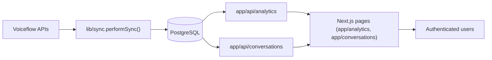

# Architecture

The Silo Storage Dashboard is a Next.js 14 application that surfaces Voiceflow analytics and raw transcript data stored in PostgreSQL. The stack is optimized for fast read-heavy dashboards while keeping ingestion logic close to the Voiceflow APIs.

## Tech Stack

| Layer | Technology | Notes |
| --- | --- | --- |
| Frontend | Next.js App Router (`app/`), React 18, Tailwind (`app/globals.css`) | Server and client components with shared design tokens |
| API Layer | Next.js Route Handlers (`app/api/**`) | Handles analytics aggregation, transcript queries, authentication, and admin actions |
| Data & Integrations | PostgreSQL (`lib/db.ts`, `db/migrations/*.sql`), Voiceflow Analytics & Transcript APIs (`lib/voiceflow.ts`, `lib/voiceflowTranscripts.ts`) | Postgres stores normalized sessions, events, turns; Voiceflow provides source-of-truth metrics |
| Auth & Security | JWT cookies (`lib/auth.ts`), rate limiting (`lib/rate-limit.ts`), middleware guard (`middleware.ts`) | Protects dashboard routes and sync endpoints |
| Ops Tooling | Node scripts (`scripts/*.js`), Railway deployments (`railway.json`) | Automates migrations, seeding, and full sync jobs |

## High-Level Flow

- **Ingestion** (`lib/sync.ts`, `app/api/sync-transcripts/route.ts`): fetches transcript summaries, loads full transcripts in parallel, writes to `vf_transcripts`, `vf_sessions`, `vf_turns`, and `vf_events`.
- **Analytics API** (`app/api/analytics/route.ts`): performs aggregated queries via `lib/analyticsQueries.ts`, augments with Voiceflow intent data, and caches responses using `lib/queryCache.ts`.
- **Dashboard UI** (`app/analytics/page.tsx`, `app/conversations/page.tsx`): consumes the internal APIs and renders cards, charts, and conversation inspectors.

## Directory Map

| Path | Purpose |
| --- | --- |
| `app/analytics`, `app/conversations`, `app/topics`, etc. | Page-level components. `app/layout.tsx` wires the shell, navigation, and fonts. |
| `app/api/**` | Route handlers for analytics, conversations, auth, sync, and admin tooling. |
| `components/` | Reusable UI (cards, charts, inspector, chat view). |
| `lib/` | Shared services: database pool, Voiceflow clients, query cache, sync orchestration, property parsing, auth helpers. |
| `db/migrations/` | SQL migrations defining Voiceflow session/event/turn tables and user/auth schema. |
| `scripts/` | Operational scripts: migrations (`migrate.js`), startup (`start.js`), seeding (`seed-admin.js`), sync utilities (`full-reset-and-sync.js`, `force-full-sync.js`). |
| `public/` | Static assets (favicons, SVGs, fonts). |

## Data Model

PostgreSQL stores Voiceflow data in analytics-friendly tables defined in `db/migrations/001_create_vf_tables.sql`:

- `vf_sessions`: Flattened per-session record with user type (`typeuser`), CTA metadata, ratings, and timestamps.
- `vf_events`: Funnel/CTA events keyed by `session_id`, storing CTA interactions and derived attributes.
- `vf_transcripts`: Raw transcript payload plus metadata/hash for change detection.
- `vf_turns`: Normalized message turns with Postgres full-text search (`text_tsv`) for future keyword filtering.
- `users`: Created in `003_create_users_table.sql` and hardened in `004_auth_security_enhancements.sql` (password policies, audit fields).

## Core Services

- **Analytics Aggregator** (`lib/analyticsQueries.ts`): Consolidates conversation stats, click-through data, satisfaction trends, location breakdown, and funnel metrics. Heavy queries are combined into a single call via `getAnalyticsDataCombined` for performance.
- **Conversation Queries** (`lib/conversationQueries.ts`): Reads transcript summaries and dialog turns with pagination, search, and fallbacks to the Voiceflow API when DB data is missing.
- **Sync/ETL** (`lib/sync.ts`, `lib/transcriptIngestion.ts`, `lib/stateReconstructor.ts`): Handles incremental syncs using last `updated_at`, parallel transcript downloads, and ingestion of derived fields.
- **Caching & Performance**: `lib/queryCache.ts` supplies a short-lived LRU cache for analytics responses, while `lib/performanceMonitor.ts` tracks query and endpoint durations to highlight slow spots.
- **Authentication**: `lib/auth.ts` issues 7-day JWT cookies, enforces strong `JWT_SECRET`, and backs `/api/auth/*` routes.

## Environment & Deployment Notes

- Development mode defaults to demo data when Voiceflow credentials are absent (`app/api/conversations`, `app/api/analytics` guard via `getProjectId`/`getApiKey`).
- Production deploys run `scripts/start.js`, which executes migrations (`scripts/migrate.js`) before launching `next start`.
- Sync jobs (cron or manual button in `app/analytics/page.tsx`) must include `CRON_SECRET` or an authenticated session when hitting `/api/sync-transcripts`. Successful syncs invalidate the analytics cache so charts refresh immediately.

Use this document as the canonical reference for how data moves through the system and where to plug in new features.

